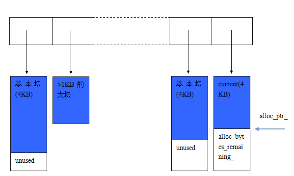

# LevelDB源码分析之内存管理类arena

  

[快乐的霖霖](https://me.csdn.net/chenglinhust) 2016-07-09 23:47:49  1350   收藏 

展开

**LevelDB源码分析之内存管理类arena**

      Leveldb的大部分内存管理依赖于C++语言的默认实现，也就是不对内存进行管理。只是在memtable的实现中用到了一个简单的内存管理器(arena)。因为memtable的内部实现skip list写入时，需要分配新节点，大量节点的直接分配可能会带来较多的碎片，影响运行效率。因此，leveldb在每个memtable中都会绑定一个arena，在memtable进行minor compact后，memtable销毁时进行统一释放。  
下图是一个arena某个运行时刻的截图。从图中可以看出，arena内部使用的基本块大小为4K，已分配的块的指保存在一个vector中。具体分配策略如下。若分配的内存可从剩余的块中分配，则直接从剩余块中分配并调整剩余块指针的位置。否则检查要分配的size是否大于1/4的block(也就是1K)，若大于则直接new所需大小的内存，将指针保存在vector中并返回内存指针。从这里可以看出，vector保存的内存块的指针大小可能>4K，也就是对大内存块直接分配。前面两个条件若都不满足，则需要new一个基本块(=4K)，将new出来的新块作为当前块，从这块当中分配内存并调整当前内存指针位置。原来当前块的剩余内存就被浪费掉了。

       如下图所示：

[](http://www.petermao.com/wp-content/uploads/2013/10/leveldb-arena.png)

      代码片段解析：

```cpp
  // alloc_ptr_指向基本块空闲内存位置，alloc_bytes_remaining_为剩余内存大小
  // blocks_保存了所有的块，包括了基本块与直接分配的大块
  // blocks_memory_表示至今blocks分配的内存
  char* alloc_ptr_;  
  size_t alloc_bytes_remaining_;
 
  // Array of new[] allocated memory blocks
  std::vector<char*> blocks_;
 
  // Bytes of memory in blocks allocated so far
  size_t blocks_memory_；
```

[](https://blog.csdn.net/chenglinhust)

[快乐的霖霖](https://blog.csdn.net/chenglinhust) 

原创文章 905获赞 171访问量 211万+

关注 [他的留言板](https://bbs.csdn.net/topics/395528198)

---------------------------------------------------


原网址: [访问](https://blog.csdn.net/chdhust/article/details/51869270)

创建于: 2020-05-14 10:44:23

目录: default

标签: `blog.csdn.net`

